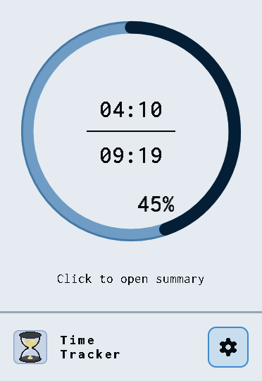
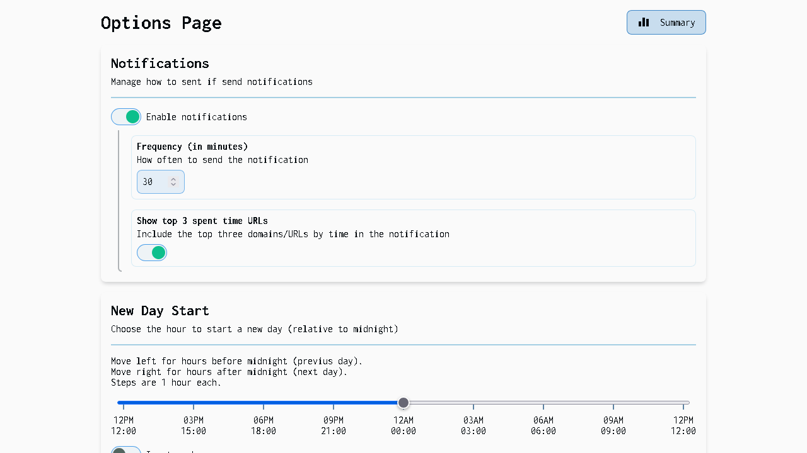
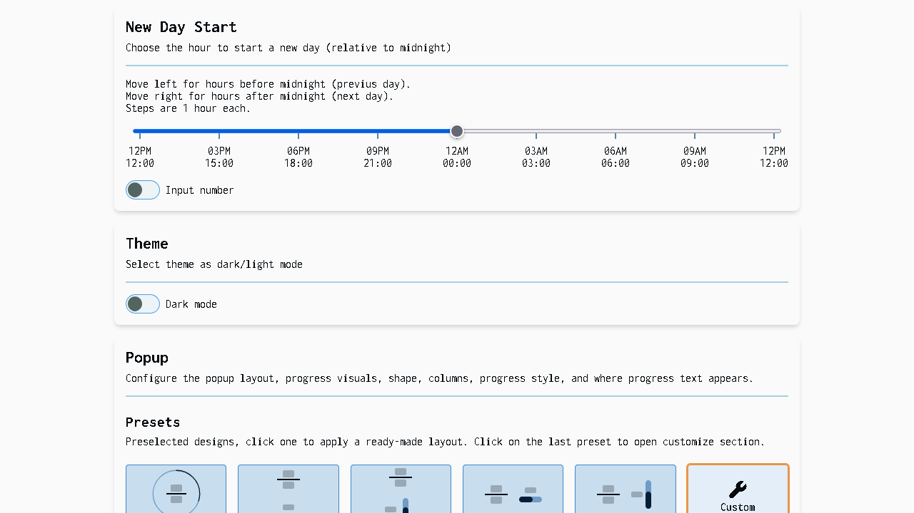
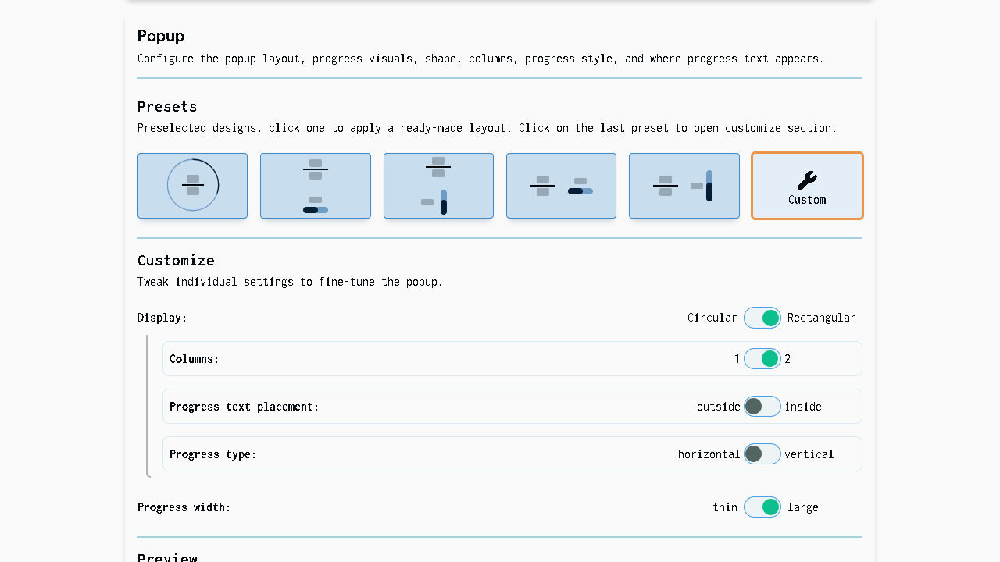
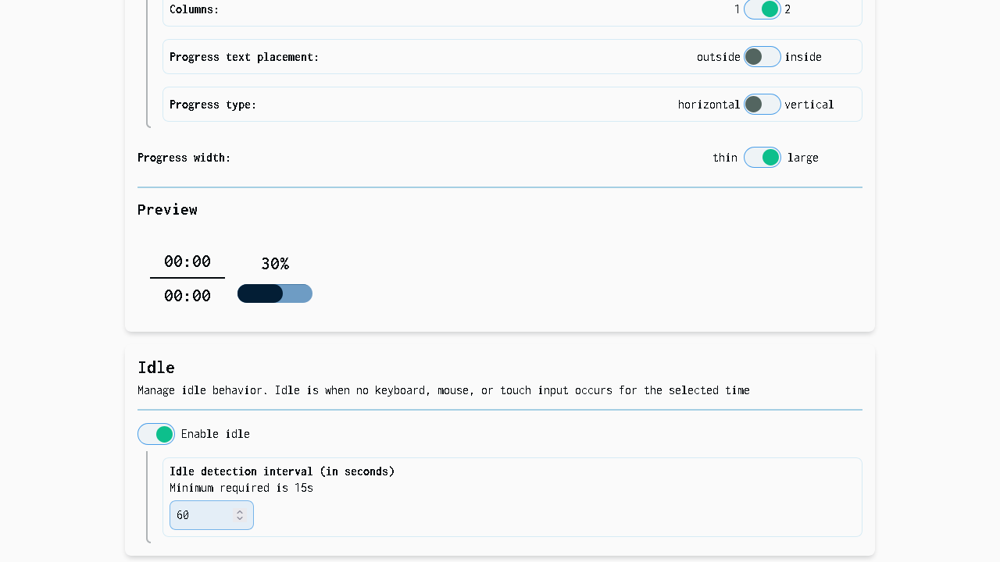
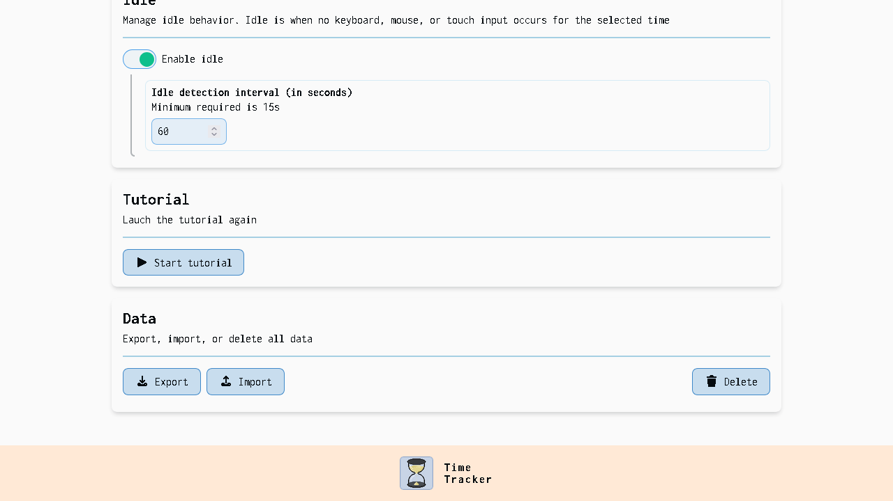
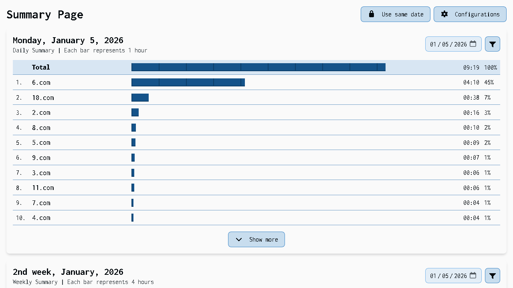
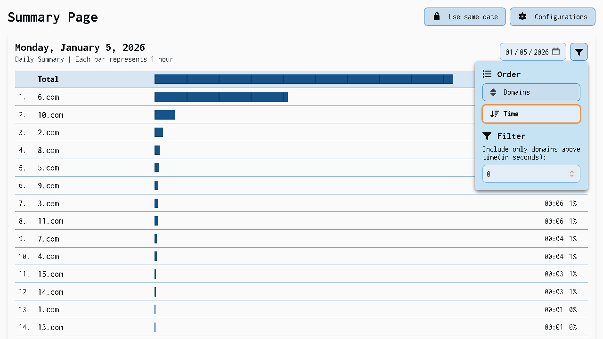
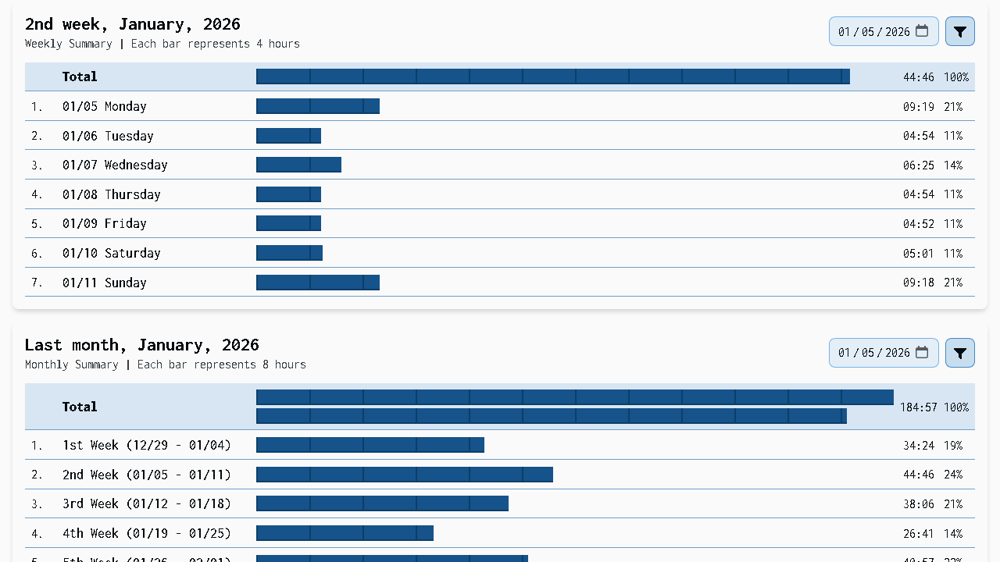
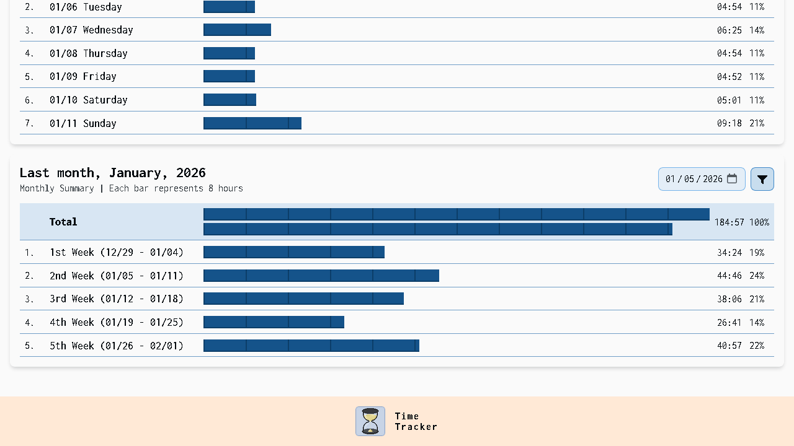

# Time-Tracker

A lightweight Firefox extension that records how much time you spend on websites with a quick popup, an options page for settings and data management, and a dashboard for time by site. Available on the Firefox Add-ons store.

## Contents

- [Screenshots](#screenshots)
- [Features](#features)
- [Usage](#usage)
- [Options available](#options-available)
- [Contributing](#contributing)

## Screenshots

### Popup

### Options page

  
  
  
  
  

### Summary page

  
  
  
  
  

## Features

- **Popup:** a quick view of today's tracked time, customizable via Options page
- **Summary page:** a dashboard to explore tracked time
  - **Daily Summary:** time spend by domain for a selected day
  - **Weekly Summary:** time spend per day in a week
  - **Monthly Summary:** time spend per week in a month
- **Options page:** customize your experience [See options available](#options-available)

## Usage

1. From the **toolbar** -> open the **popup** to see today's tracked time.
2. From the **popup** -> Open the **Summary page** for the dashboard.
3. From the **Summary** page or **Popup** -> open the **options page**.

## Options available

See what options are available

- **Notifications:** manage how to sent if send notifications:
  - **Frequency (in minutes):** how often to send the notification
  - **Show top 3 spent time URLs:** include the top three domains/URLs by time in the notification
- **New Day Start:** choose the hour to start a new day
- **Theme:** select theme as dark/light mode
- **Tutorial:** launch the tutorial
- **Popup:** Configure visual and layout
  - **Presets:** ready-made designs
  - **Customize:** Tweak individual settings
    - **Display:** Rectangular
      - **Columns:** 1 or 2
      - **Progress text placement:** outside or inside
      - **Progress type:** horizontal or vertical
      - **Progress width:** thin or large
    - **Display:** Circular
      - **Progress width:** thin or large
- **Idle:** manage idle behavior
  - **Detection interval:** time in seconds before it's considered idle.
- **Data:** export, import, or delete all data
  - Every option can select Time or Configurations, or both.
  - **Export:** generates a JSON file
  - **Import:**
    - Checks for conflicts of an overlap day, and 3 options for resolving it:
      - **Merge:** sum times per domain and per day.
      - **Keep local:** keep the extension's existing data, ignore imported overlapping day.
      - **Replace with import:** overwrite local overlapping days with the imported data.
    - Imports a JSON file
  - **Delete:** the deletion is permanent, and you cannot undo it.

## Contributing

- Repository structure:
  - **manifest.json:** extension manifest and permissions.
  - **js/:** global and backgrounds scripts
    - **background/:** background scripts that tracks time and handles events.
    - **shared/:** global scripts that are used both by background and other pages.
  - **popup/:** HTML, CSS and JS for the popup.
  - **summary/:** HTML, CSS and JS for the summary page.
  - **options/:** HTML, CSS and JS for the options page.
  - **assets/:**
    - **fonts/:** fonts used and Font Awesome icons
    - **icons/:** extension icons
    - **img/:** images used
- To run locally: load temporary add-on via about:debugging.
